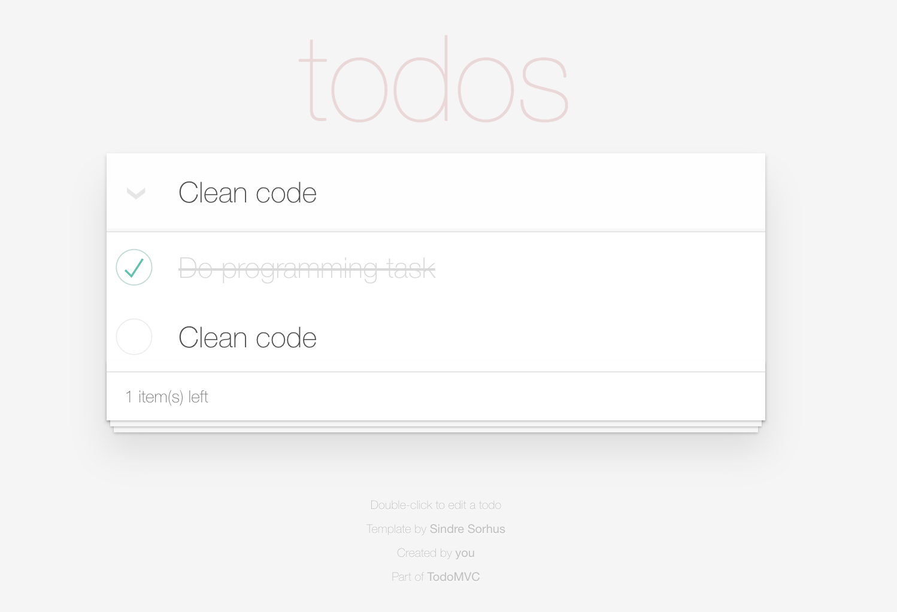

Golang Todo List
====



My little experience with Golang todo application

# Usage

1. Install `npm` package

```
cd frontend && npm install
```

2. Compose Docker

```
cd ..
docker-compose up
```

3. Enter `localhost:8000` to use.

# License

[MIT](LICENSE) © Kosate Limpongsa

